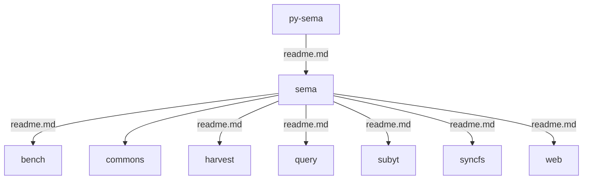
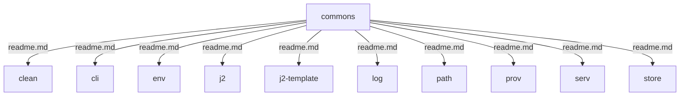

# py-sema
Overall parent of all packages involving semantic manipulation of RDF data.

## Installation

TDB

## Architecture

```mermaid
graph TD
    py-sema --> | readme.md | sema
    click sema "./README.md"
    sema --> | readme.md | bench
    click bench "./sema/bench/README.md"
    sema --> commons
    sema --> | readme.md | harvest
    click harvest "./sema/harvest/README.md"
    sema --> | readme.md | query
    click query "./sema/query/README.md"
    sema --> | readme.md | subyt
    click subyt "./sema/subyt/README.md"
    sema --> | readme.md | syncfs
    click syncfs "./sema/syncfs/README.md"
    sema --> | readme.md | web
    click web "./sema/web/README.md"
```

```mermaid
graph TD
    commons --> | readme.md | clean
    click clean "./sema/commons/clean/README.md"
    commons --> | readme.md | cli
    click cli "./sema/commons/cli/README.md"
    commons --> | readme.md | env
    click env "./sema/commons/env/README.md"
    commons --> | readme.md | j2
    click j2 "./sema/commons/j2/README.md"
    commons --> | readme.md | j2-template
    click j2-template "./sema/commons/j2-template/README.md"
    commons --> | readme.md | log
    click log "./sema/commons/log/README.md"
    commons --> | readme.md | path
    click path "./sema/commons/path/README.md"
    commons --> | readme.md | prov
    click prov "./sema/commons/prov/README.md"
    commons --> | readme.md | serv
    click serv "./sema/commons/serv/README.md"
    commons --> | readme.md | store
    click store "./sema/commons/store/README.md"
```