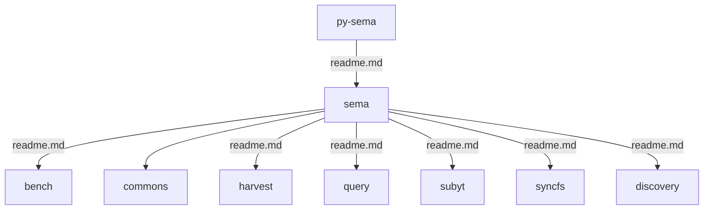
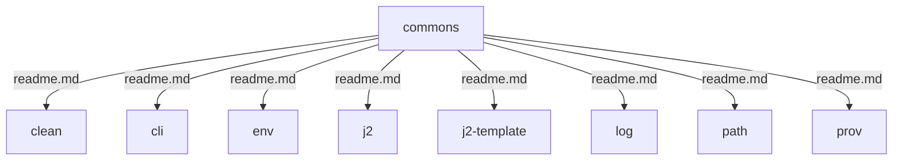

# py-sema

Overall parent of all packages involving semantic manipulation of RDF data.

## Installation

TDB

## Architecture

General migration info can be found here: [migration](https://docs.google.com/document/d/11T16tZ4w2-UVToDZfy3QhGrcAlIAdrt-F3WLt576x5g/edit)
