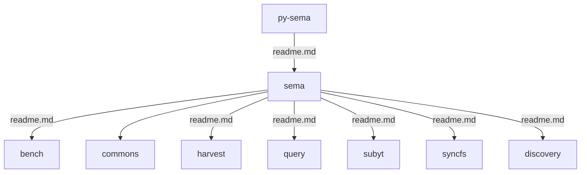
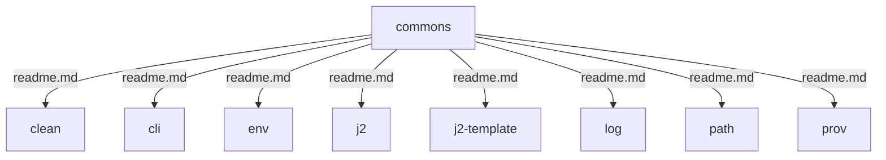

# py-sema

Overall parent of all packages involving semantic manipulation of RDF data.

## Installation

### Prerequisites

- Python 3.10 or higher
- [Poetry](https://python-poetry.org/) (recommended) or pip

### Using Poetry (Recommended)

1. Clone the repository with submodules:
```bash
git clone --recurse-submodules https://github.com/vliz-be-opsci/py-sema.git
cd py-sema
```

2. Install dependencies:
```bash
# For regular use
poetry install

# For development (includes dev tools, tests, docs)
poetry install --with dev --with tests --with docs
```

3. Activate the virtual environment:
```bash
poetry shell
```

### Using pip

You can install directly from GitHub:
```bash
pip install git+https://github.com/vliz-be-opsci/py-sema.git
```

### Virtual Environment Recommendation

We strongly recommend using a virtual environment to avoid dependency conflicts:

```bash
# Using venv
python -m venv .venv
source .venv/bin/activate  # On Windows: .venv\Scripts\activate

# Then install with pip or poetry
```

## Quick Start

After installation, you can use py-sema's CLI tools or import it as a library.

### Command Line Tools

py-sema provides several CLI commands for working with RDF data:

```bash
# Query RDF data using SPARQL templates
sema-query --source <file-or-url> --output_format csv

# Harvest RDF data
sema-harvest

# Validate RDF with SHACL shapes
sema-bench

# File synchronization
sema-syncfs

# Discovery operations
sema-get
```

Run any command with `--help` to see available options:
```bash
sema-query --help
```

### Python Library Usage

```python
from sema.query import GraphSource, DefaultSparqlBuilder

# Load RDF data from a file or SPARQL endpoint
source = GraphSource("path/to/your/data.ttl")

# Execute SPARQL queries
builder = DefaultSparqlBuilder()
# ... (add your query logic here)
```

For more detailed examples, see the [examples/](examples/) folder.

## Documentation

py-sema documentation is now available as a MyST book in [docs/](docs/).

### Local Documentation Preview

Build static HTML docs:

```bash
make docs-build
```

Start live preview server:

```bash
make docs-serve
```

Generated output is placed in `docs/_build/html`.

### GitHub Pages Publishing

Documentation is built on pull requests and deployed to GitHub Pages from
`main` when files under `docs/` change.

## Architecture


```mermaid
graph TD
    py-sema --> | readme.md | sema
    click sema "https://github.com/vliz-be-opsci/py-sema/blob/main/sema/README.md"
    sema --> | readme.md | bench
    click bench "https://github.com/vliz-be-opsci/py-sema/blob/main/sema/bench/README.md"
    sema --> commons
    sema --> | readme.md | harvest
    click harvest "https://github.com/vliz-be-opsci/py-sema/blob/main/sema/harvest/README.md"
    sema --> | readme.md | query
    click query "https://github.com/vliz-be-opsci/py-sema/blob/main/sema/query/README.md"
    sema --> | readme.md | subyt
    click subyt "https://github.com/vliz-be-opsci/py-sema/blob/main/sema/subyt/README.md"
    sema --> | readme.md | syncfs
    click syncfs "https://github.com/vliz-be-opsci/py-sema/blob/main/sema/syncfs/README.md"
    sema --> | readme.md | discovery
    click discovery "https://github.com/vliz-be-opsci/py-sema/blob/main/sema/discovery/README.md"
```


```mermaid
graph TD
    commons --> | readme.md | clean
    click clean "https://github.com/vliz-be-opsci/py-sema/blob/main/sema/commons/clean/README.md"
    commons --> | readme.md | cli
    click cli "https://github.com/vliz-be-opsci/py-sema/blob/main/sema/commons/cli/README.md"
    commons --> | readme.md | env
    click env "https://github.com/vliz-be-opsci/py-sema/blob/main/sema/commons/env/README.md"
    commons --> | readme.md | j2
    click j2 "https://github.com/vliz-be-opsci/py-sema/blob/main/sema/commons/j2/README.md"
    commons --> | readme.md | j2-template
    click j2-template "https://github.com/vliz-be-opsci/py-sema/blob/main/sema/commons/j2-template/README.md"
    commons --> | readme.md | log
    click log "https://github.com/vliz-be-opsci/py-sema/blob/main/sema/commons/log/README.md"
    commons --> | readme.md | path
    click path "https://github.com/vliz-be-opsci/py-sema/blob/main/sema/commons/path/README.md"
    commons --> | readme.md | prov
    click prov "https://github.com/vliz-be-opsci/py-sema/blob/main/sema/commons/prov/README.md"
```

## API Overview

py-sema is organized into several submodules, each handling specific aspects of RDF data manipulation:

### Core Modules

- **[query](sema/query/README.md)** - SPARQL query execution and table data extraction from knowledge graphs using templates
- **[harvest](sema/harvest/README.md)** - RDF data harvesting and collection from various sources
- **[bench](sema/bench/README.md)** - SHACL validation and benchmarking for RDF data quality
- **[discovery](sema/discovery/README.md)** - RDF resource discovery and retrieval operations
- **[syncfs](sema/syncfs/README.md)** - File system synchronization for RDF data management
- **[subyt](sema/subyt/README.md)** - Subtitle and templating utilities for RDF workflows

### Common Utilities (commons)

Shared utilities used across all modules:
- **clean** - Data cleaning and normalization
- **cli** - Command-line interface helpers
- **env** - Environment configuration management
- **j2** - Jinja2 templating support
- **log** - Logging utilities
- **path** - Path manipulation utilities
- **prov** - Provenance tracking

Each submodule has its own README with detailed information - click the links in the architecture diagrams above.

## Requirements

| Requirement | Version |
|------------|---------|
| Python | ≥ 3.10 |
| Poetry | Latest recommended |
| rdflib | ^7.0.0 |

For a complete list of dependencies, see [pyproject.toml](pyproject.toml).

## Contributing

We welcome contributions! Please see [CONTRIBUTING.md](CONTRIBUTING.md) for:
- Development setup instructions
- Code style guidelines
- Testing requirements
- Pull request process

## License

This project is licensed under the MIT License - see the [LICENSE](LICENSE) file for details.

## Citation

If you use py-sema in your research, please cite:

```
py-sema: Semantic manipulation of RDF data in Python
Flanders Marine Institute (VLIZ)
https://github.com/vliz-be-opsci/py-sema
```

## Additional Resources

- General migration info: [migration guide](https://docs.google.com/document/d/11T16tZ4w2-UVToDZfy3QhGrcAlIAdrt-F3WLt576x5g/edit)
- Repository: https://github.com/vliz-be-opsci/py-sema
- Issues: https://github.com/vliz-be-opsci/py-sema/issues
