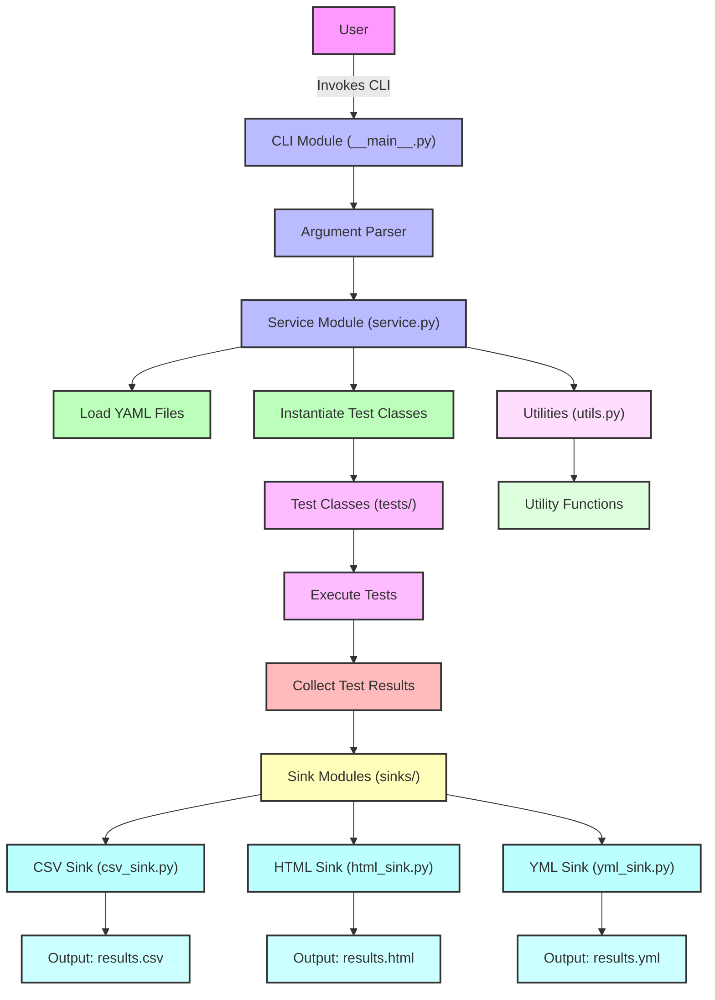

# Sema Check Module
## Test Configuration

The sema-check module uses YAML files to define test configurations. Each YAML file can contain multiple test definitions, allowing for batch testing of various endpoints or scenarios.

Yaml for tests will look like

```yaml
- url: "http://example.com"
  type: "example"
  options:
    param1: "value1"
    param2: "value2"
- url: "http://another.com"
  type: "another_test"
  options:
    paramA: "valueA"
```

The YAML configuration for tests defines the parameters for each test to be executed. Each test is represented by a YAML object with the following structure:

- `url`: The target URL for the test (required)
- `type`: The type of test to be performed (required). Possible values depend on the implemented test types.
- `options`: A map of key-value pairs for additional test parameters (optional)

Multiple tests can be defined in a single YAML file. The `options` field can vary based on the `type` of test being performed.

Example of how `options` might differ based on test type:

- For a "response_time" test:
  ```yaml
  options:
    max_response_time: 500  # milliseconds
  ```
- For a "content_check" test:
  ```yaml
  options:
    expected_content: "Welcome to our website"
    case_sensitive: false
  ```

## Testing base class

The TestBase is a dataclass that holds the test data with the following fields:

- `url: str` - The URL to test
- `type: str` - The test type
- `options: dict` - The test parameters
- `result: dict` - The test result, containing:
  - `success: bool` - Whether the test was successful
  - `message: str` - A message describing the test result or error
  - `error: bool` - Whether the test encountered an error

Note: A test can be unsuccessful (`success=False`) without encountering an error (`error=False`)

## flow of sema-check

The following flowchart illustrates the control flow of the sema-check process:  

1. User invokes the CLI  
2. The CLI module parses arguments and initiates the Service module  
3. The Service module loads YAML files and instantiates Test Classes  
4. Tests are executed and results are collected  
5. Results are output to various formats (CSV, HTML, YML) using Sink Modules  

Color Legend:  
- Pink: User interaction  
- Light Blue: Core modules  
- Green: Data loading and processing  
- Purple: Test execution  
- Yellow: Result handling  
- Cyan: Output generation  
- Light Purple: Utility functions  


