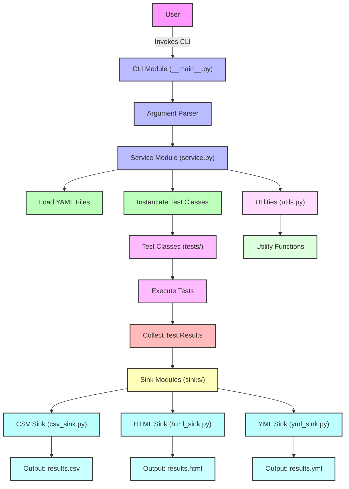

Yaml for tests will look like

```yaml
- url: "http://example.com"
  type: "example"
  options:
    param1: "value1"
    param2: "value2"
- url: "http://another.com"
  type: "another_test"
  options:
    paramA: "valueA"
```

where `url` is the URL to test, `type` is the test type, and `options` are the test parameters.

## Testing base class

The TestBase is a dataclass that holds the test data. It has the following fields:

- `url` - the URL to test
- `type` - the test type
- `options` - the test parameters
- `result` - the test result
  - `success`: boolean, whether the test was successful
  - `message`: string, a message describing the test result, this can also be the error message
  - `error`: boolean, whether the test failed due to an error

## flow of sema-check


